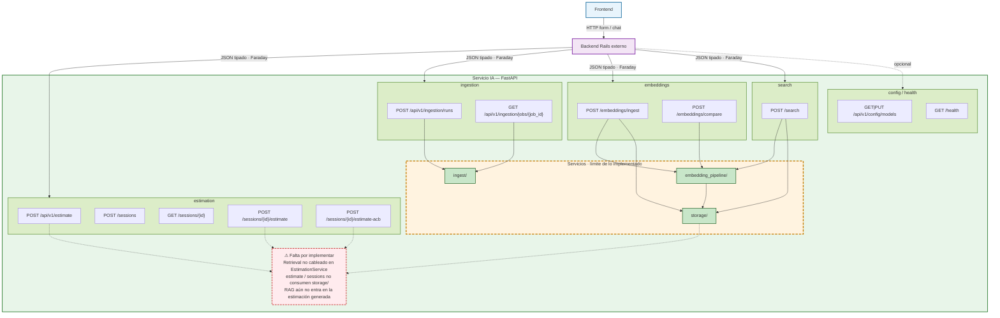
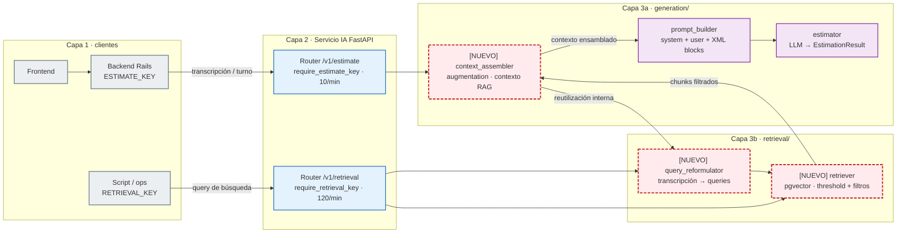

# Diagnóstico arquitectónico — Sesión 09 (pre-work)

## 1. Diagrama de la arquitectura actual

Tras las Sesiones 06–08 el monorepo sigue siendo un sistema de **tres capas**: un frontend de usuario, un backend de negocio Rails externo (`estimator-web`) y el **servicio IA FastAPI** (`app/`), que es donde vive toda la lógica de estimación, guardrails, caches, conversación, ingestión de corpus y pipeline RAG.

El servicio IA ya no es solo un endpoint de estimación tipada. Acumula, de forma aditiva:

- **S06 — datos e ingestión offline**: catálogo versionado, parsers (JSON/TXT), limpieza Pandera, PII con Presidio, jobs async en Postgres (`/api/v1/ingestion/`*).
- **S07 — embedding pipeline**: chunking (varias estrategias), embedder OpenAI, comparación de estrategias (`/embeddings/compare`). Antes vivía en `app/embedding_pipeline/`; hoy está bajo `app/generation/rag/`.
- **S08 — persistencia y búsqueda**: `store/` (pgvector: `documents` / `chunks`), `ingest_service` (chunk → embed → persist en una transacción) y `retriever` (`POST /search`). El retrieval **existe como endpoint**, pero **no está cableado** en `EstimationService.estimate()`.

Además permanecen las piezas de sesiones anteriores: CAG (exacto + semántico), estimación single-shot y conversacional, bucle Actor-Critic-Boss, foundation (LLM, prompts, guardrails, attachments, persistence).

Mapeo de los nombres del enunciado a las rutas reales del repo:


| Enunciado             | Ruta real                                                                  |
| --------------------- | -------------------------------------------------------------------------- |
| `ingest/`             | `app/ingestion/`                                                           |
| `embedding_pipeline/` | `app/generation/rag/` (chunking + embedding + analysis + `ingest_service`) |
| `storage/`            | `app/generation/rag/store/` (+ `retriever.py`)                             |





Lectura del diagrama:

- **Azul**: Frontend.
- **Violeta**: Backend Rails externo (Faraday, JSON tipado) → dominios HTTP del servicio IA.
- **Verde**: endpoints por dominio (`estimation`, `ingestion`, `embeddings`, `search`, `config/health`) y los tres servicios de corpus (`ingest/`, `embedding_pipeline/`, `storage/`). Las flechas sólidas son las únicas llamadas reales hoy: `ingestion` → `ingest/`; `embeddings` → `embedding_pipeline/` (+ `storage/` en `/embeddings/ingest`); `search` → `embedding_pipeline/` + `storage/`; y `embedding_pipeline/` → `storage/`.
- **Rojo**: hueco actual. `POST /api/v1/estimate` y los `…/estimate` / `…/estimate-acb` de sessions no consumen `storage/`; el retrieval no está cableado en `EstimationService`.

## 2. Trace manual — transcripción `02_ambiguous.txt`

Transcripción: reunión exploratoria con Rubén Castaño (Casa Castaño, tienda gourmet). Pide, de forma vaga, e-commerce + fidelización/puntos + panel de pedidos/stock + pago con tarjeta + email transaccional. Sector implícito: **ecommerce / retail**, no banca.

Corpus en pgvector para este run: los **17** presupuestos de `data/budgets_sample.json` (vía `scripts/query_examples.py` → `POST /embeddings/ingest`; en esta ejecución `0 ingested, 17 already present`).

No hay endpoint HTTP dedicado solo a embeber texto libre: el embed se hace con `OpenAIEmbedder` (`app.generation.rag.embedding.embedder`, modelo `text-embedding-3-small`). `POST /search` (S08) acepta la transcripción como `query` string y vuelve a embeber por dentro.

### Comandos reproducibles

```bash
# stack up: docker compose up -d  (API en :8000)

# 1) Asegurar corpus completo en pgvector (idempotente)
docker exec -w /app estimator python scripts/query_examples.py

# 2) Trace embed + search
cat examples/transcripts/02_ambiguous.txt | docker exec -i estimator \
  python -c "from pathlib import Path; import sys; Path('/tmp/02_ambiguous.txt').write_text(sys.stdin.read())"
docker exec -w /app -e PYTHONPATH=/app estimator \
  python scripts/trace_s08_ambiguous.py /tmp/02_ambiguous.txt
```

Script de trace: `scripts/trace_s08_ambiguous.py` — `OpenAIEmbedder.embed_one(transcript)` y luego `POST /search` con `{"query": <transcript>, "k": 5}`.

### Paso 1 — Embed de la transcripción completa

**Llamada:** `OpenAIEmbedder.embed_one(transcript)` (mismo modelo que ingest/search).

**Respuesta cruda**:

```json
{
  "module": "app.generation.rag.embedding.embedder.OpenAIEmbedder",
  "model": "text-embedding-3-small",
  "dimensions": 1536,
  "first_component": 0.005161285400390625,
  "last_component": 0.0165557861328125,
  "l2_norm": 0.9997266726900388,
  "chars": 2855
}
```

**Comentario:** vector denso 1536-d con norma L2 ≈ 1. Representa el sentido global de la reunión (digitalizar una tienda gourmet: venta online, loyalty, panel, pagos, email). Embebido entero, diluye señales concretas frente al tono conversacional ambiguo.

### Paso 2 — Búsqueda semántica top-5

**Llamada:**

```http
POST http://127.0.0.1:8000/search
Content-Type: application/json

{"query": "<contenido íntegro de 02_ambiguous.txt>", "k": 5}
```

**Respuesta cruda**:

```json
{
  "k": 5,
  "search_time_ms": 252,
  "results": [
    {
      "chunk_id": 20,
      "document_id": 6,
      "chunk_type": "budget_component",
      "content": "[Project: Headless e-commerce storefront with personalized recommendations]\n[Client sector: ecommerce | Year: 2024 | Main tech: node]\n\nComponent: Product catalog API\nDescription: GraphQL catalog API with faceted search, inventory availability and multi-currency pricing backed by Elasticsearch.\nTech stack: node, graphql, elasticsearch\nComplexity: medium\nEstimated hours: 150",
      "distance": 0.6012856456683742,
      "metadata": {
        "year": 2024,
        "budget_id": "BUD-2024-005",
        "complexity": "medium",
        "component_id": "CATALOG-001",
        "client_sector": "ecommerce",
        "estimated_hours": 150,
        "main_technology": "node"
      }
    },
    {
      "chunk_id": 21,
      "document_id": 6,
      "chunk_type": "budget_component",
      "content": "[Project: Headless e-commerce storefront with personalized recommendations]\n[Client sector: ecommerce | Year: 2024 | Main tech: node]\n\nComponent: Cart and checkout service\nDescription: Stateless cart service with promotion engine, tax calculation and a checkout orchestration that integrates the payment provider.\nTech stack: node, redis, postgresql\nComplexity: high\nEstimated hours: 140",
      "distance": 0.6065278791658069,
      "metadata": {
        "year": 2024,
        "budget_id": "BUD-2024-005",
        "complexity": "high",
        "component_id": "CART-002",
        "client_sector": "ecommerce",
        "estimated_hours": 140,
        "main_technology": "node"
      }
    },
    {
      "chunk_id": 22,
      "document_id": 6,
      "chunk_type": "budget_component",
      "content": "[Project: Headless e-commerce storefront with personalized recommendations]\n[Client sector: ecommerce | Year: 2024 | Main tech: node]\n\nComponent: Personalized recommendations\nDescription: Collaborative-filtering recommendations served from a feature store and exposed as a low-latency API for product and cart pages.\nTech stack: node, redis\nComplexity: medium\nEstimated hours: 110",
      "distance": 0.6295456703554114,
      "metadata": {
        "year": 2024,
        "budget_id": "BUD-2024-005",
        "complexity": "medium",
        "component_id": "RECO-003",
        "client_sector": "ecommerce",
        "estimated_hours": 110,
        "main_technology": "node"
      }
    },
    {
      "chunk_id": 23,
      "document_id": 6,
      "chunk_type": "budget_component",
      "content": "[Project: Headless e-commerce storefront with personalized recommendations]\n[Client sector: ecommerce | Year: 2024 | Main tech: node]\n\nComponent: Storefront PWA\nDescription: Progressive web app storefront consuming the headless APIs with server-side rendering for SEO.\nTech stack: next_js, react\nComplexity: low\nEstimated hours: 60",
      "distance": 0.6317055573188839,
      "metadata": {
        "year": 2024,
        "budget_id": "BUD-2024-005",
        "complexity": "low",
        "component_id": "STORE-004",
        "client_sector": "ecommerce",
        "estimated_hours": 60,
        "main_technology": "node"
      }
    },
    {
      "chunk_id": 31,
      "document_id": 9,
      "chunk_type": "budget_component",
      "content": "[Project: Fashion returns management and resale portal]\n[Client sector: ecommerce | Year: 2023 | Main tech: dotnet]\n\nComponent: Returns portal\nDescription: Self-service returns portal with label generation, reason capture and automatic restock or resale routing.\nTech stack: dotnet, sqlserver\nComplexity: medium\nEstimated hours: 140",
      "distance": 0.6389217112729286,
      "metadata": {
        "year": 2023,
        "budget_id": "BUD-2024-008",
        "complexity": "medium",
        "component_id": "RET-001",
        "client_sector": "ecommerce",
        "estimated_hours": 140,
        "main_technology": "dotnet"
      }
    }
  ]
}
```

### Paso 3 — Lectura chunk a chunk


| #   | Chunk                                     | Presupuesto                                     | Sector    | ¿Relevante para Rubén?                                                                                                          |
| --- | ----------------------------------------- | ----------------------------------------------- | --------- | ------------------------------------------------------------------------------------------------------------------------------- |
| 1   | `CATALOG-001` catálogo + stock/precios    | `BUD-2024-005` ShopSphere (headless e-commerce) | ecommerce | **Sí.** Quiere que la gente vea productos y él vea stock; el catálogo con availability encaja.                                  |
| 2   | `CART-002` carrito + checkout + pago      | mismo                                           | ecommerce | **Sí.** “Vender por internet” + “pagar con tarjeta” + no abandonar el carrito, es justo lo que pide.                            |
| 3   | `RECO-003` recomendaciones personalizadas | mismo                                           | ecommerce | **Parcial.** Él habla de fidelizar con puntos/club, no de filtro colaborativo Sector correcto, pero la feature es distinta.     |
| 4   | `STORE-004` storefront PWA                | mismo                                           | ecommerce | **Sí, a nivel de producto.** Es la cara web de “entrar, ver y comprar”;es más técnico de lo que Rubén dice en la transcripción. |
| 5   | `RET-001` portal de devoluciones          | `BUD-2024-008` StyleLoop (fashion returns)      | ecommerce | **No / débil.** Mismo sector, pero distinto problema.                                                                           |


**Veredicto honesto:** con los 17 budgets indexados, el retrieval **sí es útil** para este caso: el ranking aterriza en ShopSphere (catálogo/carrito/storefront). Falta cobertura explícita de loyalty y del “panel de pedidos del día”; QuickShop (`017`) habría sido un analogía MVP más cercana en tono y no aparece. Si se cableara a `EstimationService`, el LLM recibiría contexto de e-commerce razonable.

## 3. Diagnóstico: cinco fallos identificados

Cinco fallos concretos y verificables que hoy impiden convertir `02_ambiguous.txt` en una estimación de calidad. Observaciones ancladas al trace de la sección 2 y al estado del código tras S08.

### Fallo 1 — El retrieval no entra en la estimación

- **Problema observado:** el trace llega a `POST /search` y obtiene chunks útiles (`BUD-2024-005`), pero `EstimationService.estimate()` / `estimate_conversational()` no llaman al `SemanticRetriever`. Una estimación real seguiría siendo solo prompt + LLM (o CAG), sin esos históricos.
- **Causa probable:** decisión arquitectónica: `store/` + `retriever` existen como endpoint aparte; el cableado RAG → generación quedó fuera del request path de estimación.
- **Propuesta de solución:** una etapa de *retrieve-then-generate* dentro de `EstimationService` que inyecte los chunks rankeados en el prompt de estimación antes de la generación en el LLM.

### Fallo 2 — Query larga conversacional vs chunks cortos de componente

- **Problema observado:** se embebe la transcripción entera y las distancias del top-5 quedan comprimidas en una banda estrecha (~0.601–0.639): catálogo, carrito, reco, PWA y returns van casi empatados.
- **Causa probable:** Al hacer embedding de la transcripcion cruda, se genera mucho ruido y se pierden señales de la transcripcion.
- **Propuesta de solución:** reformulación de la query usando extracción estructurada + query re-writing para mejorar la precisión de la región donde viven los chunks relevantes.

### Fallo 3 — Top-k sin umbral: entra ruido del mismo sector

- **Problema observado:** el 5.º hit es `BUD-2024-008::RET-001` (portal de devoluciones moda), distancia 0.639 — casi igual que el storefront PWA (0.632). Rubén no pide returns; el retriever lo devuelve igual porque `k=5` siempre rellena huecos.
- **Causa probable:** `SemanticRetriever` rankea por distancia coseno y corta en `k`; no hay umbral de similitud mínima ni filtro por `client_sector` / tipo de componente, aunque esos campos viajan en `metadata`.
- **Propuesta de solución:** usar política de threshold para descartar chunks que no cumplan distancia mínima y filtros opcionales sobre metadata antes de pasar contexto al generador.

### Fallo 4 — Una sola búsqueda no cubre los requisitos distintos de la reunión

- **Problema observado:** Rubén pide al menos cinco cosas distintas (tienda online, puntos/club, panel de pedidos/stock, pago con tarjeta, email de pedido). El top-5 está dominado por un solo presupuesto. No aparece nada de loyalty ni de dashboard operativo; `BUD-2024-017` (QuickShop: cart + “Pay with card” + “Order email”) no entra aunque es más cercano en tono MVP.
- **Causa probable:** el retrieval es de una sola query global + ranking por similitud agregada favorece el documento “más parecido en bloque” (ShopSphere rico) frente a cubrir el abanico de intenciones; no hay multi-query ni diversidad por `budget_id`/`component_id`.
- **Propuesta de solución:** recuperar por requisito  y fusionar resultados con diversidad (p. ej. al menos un hit de checkout/pago, uno de admin/panel, uno de notificaciones), no solo el vecindario de un único proyecto headless.

### Fallo 5 — El corpus no ancla lo que el cliente enfatiza (loyalty + panel)

- **Problema observado:** en el paso 3 del trace, `RECO-003` sale como “parcial” (recomendaciones ≠ club de puntos) y no hay ningún chunk de “panel de pedidos del día / stock del cuaderno”. Aunque el sector ecommerce está bien representado, las dos demandas más importantes de la reunión no tienen vecino histórico claro.
- **Causa probable:** el seed `budgets_sample.json` está sesgado a componentes técnicos de producto (catálogo, cart, IoT, PSD2…); no hay presupuestos con loyalty/points ni back-office retail simple, así que el embedding no puede recuperar lo que no está indexado.
- **Propuesta de solución:** extraer requisitos de la transcripción y, tras el retrieve, marcar los que no tienen hit por encima del umbral como *sin evidencia*.

### Otros

- **Sin ensamblado de contexto RAG hacia el prompt:** las plantillas `estimation/v1`–`v3` no tienen bloque para `SearchHit`s; falta `context_assembler` entre retriever y prompt builder.
- **Sin grounding obligatorio en el schema:** `EstimationResult` no exige citar `budget_id`/`component_id` ni justificar horas con el chunk.
- **CAG ≠ RAG de presupuestos:** el cache semántico Redis no aporta componentes de ShopSphere.
- **Idioma query/corpus:** transcript ES coloquial vs chunks EN técnicos — refuerza el fallo 2.

## 4. Arquitectura objetivo — retrieval cableado en la estimación separación de servicios

Mismo esquema de tres capas. Las cajas con borde **discontinuo rojo** y etiqueta `[NUEVO]` no existen hoy (o no están en el path de estimación); el resto ya está en el servicio o es el equivalente de lo dibujado en la sección 1.

Layout de referencia (nombres del enunciado; mapeables al `app/` actual):

```text
src/estimator/
├── api/routers/
│   ├── estimate.py      # /v1/estimate  (sessions estimate / estimate-acb)
│   └── retrieval.py     # /v1/retrieval (hoy: POST /search)
├── retrieval/
│   ├── query_reformulator.py   [NUEVO]
│   └── retriever.py            [NUEVO: threshold + filtros; hoy solo top-k]
└── generation/
    ├── context_assembler.py    [NUEVO]
    ├── prompt_builder.py       (hoy: foundation/prompts)
    └── estimator.py            (hoy: EstimationService)
```




`query_reformulator` convierte la transcripción cruda en una o varias queries de búsqueda; `retriever` embebe esas queries, consulta pgvector y aplica threshold + filtros de metadata antes de devolver chunks; `context_assembler` (augmentation dentro de `generation/`) une transcript + chunks recuperados en el bloque de contexto que `prompt_builder` inyecta y que `estimator` manda al LLM.   

El dato que fluye entre los módulos nuevos es siempre el transcript del usuario, esto es, el contexto a través del cuál se recuperan datos de proyectos anteriores para enriquecer el prompt que se le pasa al LLM.

La pieza más crítica, y la primera que añadiría si sólo pudiese construir una, sería el `context_assembler` . Con un ensamblador mínimo que llame al SemanticRetriever e inyecte los hits en el prompt ya se puede utilizar esta búsqueda semántica sobre la generación. Sin esta pieza, el resto de módulos propuestos aquí sólo servirían para el endpoint de búsqueda.